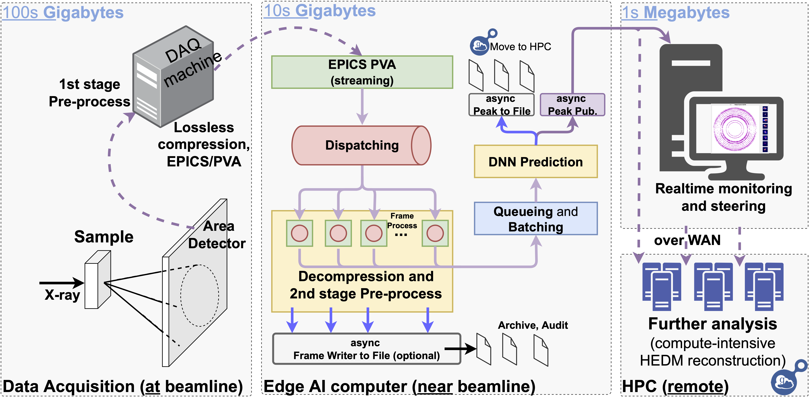

# edgeHEDM
Realtime Bragg peak analysis on the edge near data source


This repo hosts code to localize (with sub-pixel accuracy) Bragg peaks from X-ray diffraction frames streamed from EPICS-enabled area detector.
[BraggNN](https://doi.org/10.1107/S2052252521011258) trained using code in this [repo](https://github.com/lzhengchun/BraggNN) or remote data center AI-system using this distributed [workflow](https://arxiv.org/abs/2105.13967), is used to localize Bragg peaks faster than conventional psuedo-Voigt.

For debug and evaluation purpose, one can also use `daq-simu-pva.py` to simulate data (of given) streamed from the area detector.



## Citation
If you use this code for your research, please cite our paper(s):

- Liu, Zhengchun, Hemant Sharma, J-S. Park, Peter Kenesei, Antonino Miceli, Jonathan Almer, Rajkumar Kettimuthu, and Ian Foster. "BraggNN: fast X-ray Bragg peak analysis using deep learning." IUCrJ 9, no. 1 (2022).

Or via bibtex

```
@article{liu2022braggnn,
  title={BraggNN: fast X-ray Bragg peak analysis using deep learning},
  author={Liu, Zhengchun and Sharma, Hemant and Park, J-S and Kenesei, Peter and Miceli, Antonino and Almer, Jonathan and Kettimuthu, Rajkumar and Foster, Ian},
  journal={IUCrJ},
  volume={9},
  number={1},
  year={2022},
  publisher={International Union of Crystallography}
}

```
